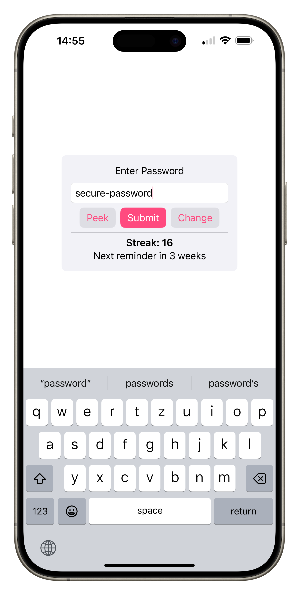

# Password Trainer

A tiny app for learning passwords by heart with spaced repetition.

### Usage

I recommend randomizing all your passwords with a secure length. You can then learn a small handful of "master passwords" by heart and use them for things like your iCloud/Google account or login password, storing the rest securely in the keychain or another password manager.

